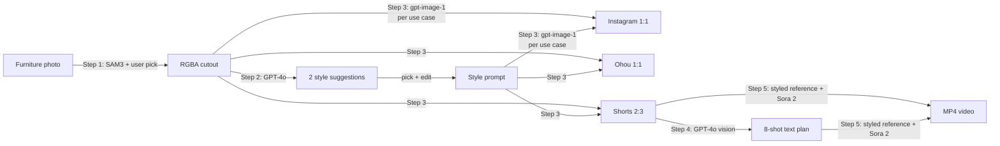

# Furniture App

가구 사진 1장을 입력으로 받아 **배경 제거 → 스타일 추천 → 용도별 새 배경 생성 → 샷 플랜 → 영상** 까지 자동화하는 5-step 파이프라인입니다. UI 는 Streamlit 하나로 통합되어 있고, 각 단계 산출물을 화면에서 확인하면서 다음 단계로 넘어갈 수 있습니다.

Step 3 는 콘텐츠 용도별로 분기합니다:

- **인스타그램 피드 (1:1)** / **오늘의집 썸네일 (1:1)** → Step 3 산출물이 최종 결과 (이미지)
- **숏폼 세로 (2:3)** → Step 3 산출물을 첫 프레임 reference 로 사용해 Step 4·5 영상 생성으로 진행



## Steps

| # | Class | Model | Input | Output |
|---|---|---|---|---|
| 1 | `Sam3FurnitureSegmenter`             | `facebook/sam3`               | 가구 사진             | RGBA cutout (사용자가 인스턴스 선택) |
| 2 | `StyleRecommender`                   | `gpt-4o` (vision)             | RGBA cutout           | 2 style suggestions (JSON) |
| 3 | `BaseBackgroundGenerator` 의 서브클래스 (`InstagramFeed` / `OhouThumbnail` / `Shorts`) | `gpt-image-1` (`images.edit`) | RGBA cutout + style prompt | use-case별 styled 이미지 |
| 4 | `FurnitureShotPlanGenerator`         | `gpt-4o` (vision)             | shorts styled 이미지  | 8-shot text plan + Continuity notes |
| 5 | `SoraReferenceVideo`                 | `gpt-4o` + `sora-2`           | shorts styled 이미지 + shot plan | MP4 video |

- 각 클래스는 `PipelineStep` 을 상속해서 `__call__(...)` 또는 `.run(...)` 으로도 직접 호출할 수 있습니다.
- 일반 (use case 미지정) 클래스 `BackgroundGenerator` 도 여전히 export 되어 있어 입력 비율을 그대로 따라가는 fallback 으로 쓸 수 있습니다.

## Repository layout

```
furniture_video/
├── README.md
├── requirements.txt
├── .env.example
├── .gitignore
├── app.py                 # Streamlit UI (모든 step 통합)
├── models/
│   ├── __init__.py
│   ├── base.py
│   ├── segment.py        # Step 1
│   ├── style.py          # Step 2
│   ├── background.py     # Step 3 (Base + 3 use-case 서브클래스)
│   ├── shot_plan.py      # Step 4
│   └── video_ref.py      # Step 5
└── utils/
    ├── __init__.py
    ├── images.py         # PIL / size picker / letterbox / alpha mask / mask viz
    └── orientation.py    # EXIF 안전 보정
```

## Setup

```bash
git clone <this-repo>
cd furniture_video

python -m venv .venv
source .venv/bin/activate    # Windows: .venv\Scripts\activate

pip install -r requirements.txt
# torch 는 환경에 맞춰 별도 설치 권장:
# https://pytorch.org/get-started/locally/

cp .env.example .env        # OPENAI_API_KEY / HF_TOKEN 채우기
huggingface-cli login       # facebook/sam3 는 gated 모델이라 access 요청 필요
```

## Run

```bash
streamlit run app.py
```

브라우저가 열리면 사이드바에서 가구 이미지를 업로드(또는 샘플 경로 지정)하고 단계별로 진행합니다.

### Step 1 — SAM3 + 가구 선택 (인터랙티브)

- **SAM3 실행** 버튼을 누르면 prompt 에 매칭되는 모든 인스턴스를 검출합니다.
- 가운데 디버그 오버레이에는 인스턴스가 색깔과 `#번호 score` 라벨로 표시됩니다.
- 가구를 **클릭** 하면 그 인스턴스가 토글되고, 왼쪽 **체크박스** 로도 똑같이 선택할 수 있습니다.
- 오른쪽 패널에 “선택된 인스턴스만 alpha 로 남긴 cutout” 미리보기가 즉시 갱신됩니다.
- 기본값은 가장 큰 인스턴스 1개. 앞 가구만 선택하면 됩니다 (여러 개 동시에 선택해 union 으로 묶어도 됨).

### Step 2 — 스타일 추천

- GPT-4o vision 으로 가구를 분석해 어울리는 스타일 2개를 받아옵니다.
- 라디오로 1개를 고르고, 필요하면 prompt 를 직접 수정합니다.

### Step 3 — 용도별 새 배경 생성

- 공통 system prompt (`BASE_SYSTEM_INSTRUCTION`) 에 “가구 정체성·형태·재질 보존 + 전체 relighting / color-grading + cutout seam 제거 + 카메라 perspective 유지” 같은 hard constraint 가 한 번만 정의돼 있고, 각 서브클래스는 그 위에 자신의 **컴포지션·비율 조항**을 append 합니다.
- UI 의 multi-select 로 인스타 / 오늘의집 / 숏폼 중 원하는 만큼 동시에 생성합니다. 결과는 그리드로 비교 가능하며, 그 중 하나를 골라 다음 단계로 진행합니다.
- **숏폼** 결과를 골랐을 때만 Step 4·5 가 활성화되고, **인스타·오늘의집** 결과는 그 자체가 최종 산출물입니다.
- 결과가 마음에 들지 않으면 Step 2 로 돌아가 prompt 를 수정하고 다시 실행하면 downstream 결과가 자동으로 무효화됩니다.

### Step 4 — 8-shot 텍스트 플랜

- GPT-4o vision 이 Step 3 의 **숏폼** styled 이미지를 직접 보고 8-shot 카메라 플랜을 텍스트로 작성합니다.
- 출력은 정확히 다음 8단계 + Continuity notes 구조입니다:

  ```
  1. Establishing move: ...
  2. Hero furniture move: ...
  3. Detail styling move: ...
  4. Material close-up move: ...
  5. Functional/lifestyle move: ...
  6. Surface or storage detail move: ...
  7. Light and shadow move: ...
  8. Closing move: ...

  Continuity notes: ...
  ```
- 새 이미지를 생성하지 않기 때문에 기존 3×3 이미지 기획안 방식보다 비용이 낮고, Sora 입력 구조와도 더 잘 맞습니다. 텍스트는 UI 에서 직접 수정한 뒤 Step 5 로 넘겨도 됩니다.

### Step 5 — Sora 2 비디오

- Step 3 styled image 를 Sora 의 `input_reference` 로 넣어 첫 프레임을 고정하고, Step 4 shot plan 을 GPT-4o 가 최종 Sora prompt 로 다듬어 영상 1개를 생성합니다.
- 옵션: 모델(`sora-2` / `sora-2-pro`), 해상도(세로 기본), 길이(초), LLM 추가 제약.
- 완료되면 MP4 가 자동 재생되고, 실제로 Sora 에 보낸 prompt 도 expander 에서 볼 수 있습니다.

### 산출물 (`output/app/` 기본)

파일명에 `<use_case>`, `<style_slug>`, `<timestamp>` 가 붙어 같은 가구를 여러 스타일·여러 용도로 돌려도 덮어쓰이지 않습니다.

```
01_cutout_<sam_ts>.png                                    # 사용자가 선택한 가구 (RGBA)
03_styled__<use_case>__<style_slug>__<bg_ts>.png          # use-case별 styled 이미지
04_shot_plan__<style_slug>__<ts>.txt                      # shorts 전용 8-shot plan
05_video__<style_slug>__<ts>.mp4                          # Sora 2 최종 영상
05_video__<style_slug>__<ts>.prompt.txt                   # Sora 에 실제 전송된 long prompt
```

## Programmatic use

UI 없이 직접 호출해서 노트북·서버에서도 그대로 쓸 수 있습니다.

```python
from models import (
    Sam3FurnitureSegmenter,
    StyleRecommender,
    InstagramFeedBackgroundGenerator,
    OhouThumbnailBackgroundGenerator,
    ShortsBackgroundGenerator,
    USE_CASE_REGISTRY,
    FurnitureShotPlanGenerator,
    SoraReferenceVideo,
)

# Step 1 — SAM3 가구 분리
seg = Sam3FurnitureSegmenter(text_prompt="furniture", select="largest")
seg_result = seg("data/cabinet.jpg")

# Step 2 — 스타일 추천
rec = StyleRecommender()
styles = rec(seg_result.image_rgba).styles
chosen = styles[0]

# Step 3 — 콘텐츠 용도별 배경 생성
ig  = InstagramFeedBackgroundGenerator()(seg_result.image_rgba, chosen.prompt)
oh  = OhouThumbnailBackgroundGenerator()(seg_result.image_rgba, chosen.prompt)
sh  = ShortsBackgroundGenerator()(seg_result.image_rgba, chosen.prompt)

ig.image.save("output/insta.png")    # 인스타 피드 최종
oh.image.save("output/ohou.png")     # 오늘의집 썸네일 최종

# Step 4·5 — 숏폼 결과만 영상으로
planner = FurnitureShotPlanGenerator()
plan = planner(sh.image, output_path="output/shot_plan.txt")

video = SoraReferenceVideo(seconds="8")
v = video(sh.image, plan.shot_plan, output_path="output/video.mp4")
print(v.output_path, v.video_prompt)

# 용도 문자열 → 클래스 매핑이 필요할 때
SomeGenerator = USE_CASE_REGISTRY["shorts"]
```

`Sam3FurnitureSegmenter` 의 `select` 옵션은 `union` / `top` / `largest` / `center` / `foreground` / `index` 를 지원합니다. UI 흐름과 똑같이 “사용자가 직접 인덱스를 고르는” 동작을 코드에서 재현하려면 `select="union"` 으로 모든 인스턴스(`masks_np`, `scores_np`)를 받아 직접 union 하면 됩니다.

각 use-case 서브클래스는 `BaseBackgroundGenerator` 의 `use_case_instruction` / `default_size` 만 override 한 형태라서, 새 플랫폼(예: 유튜브 썸네일)을 추가하고 싶다면 같은 패턴으로 클래스 하나를 만들고 `USE_CASE_REGISTRY` 에 등록하면 됩니다.

## Notes

- **Sora 2 의 한 호출은 “하나의 연속 샷”** 입니다. Step 4 shot plan 의 숫자는 실제 컷 편집 지시가 아니라, 하나의 영상 안에서 카메라가 어떻게 진행할지 GPT-4o 에게 알려주는 prompt 재료입니다.
- **Sora API 종료 예정일: 2026-09-24**. 운영용으로는 `models/video_ref.py` 를 Seedance 2.0 등 다른 모델의 어댑터로 교체하면 됩니다 (`SoraReferenceVideo.run(reference_image, shot_plan, output_path)` 시그니처 유지 권장).
- SAM3 는 gated 모델이라 HF access 승인 후에만 가중치를 받을 수 있습니다.
